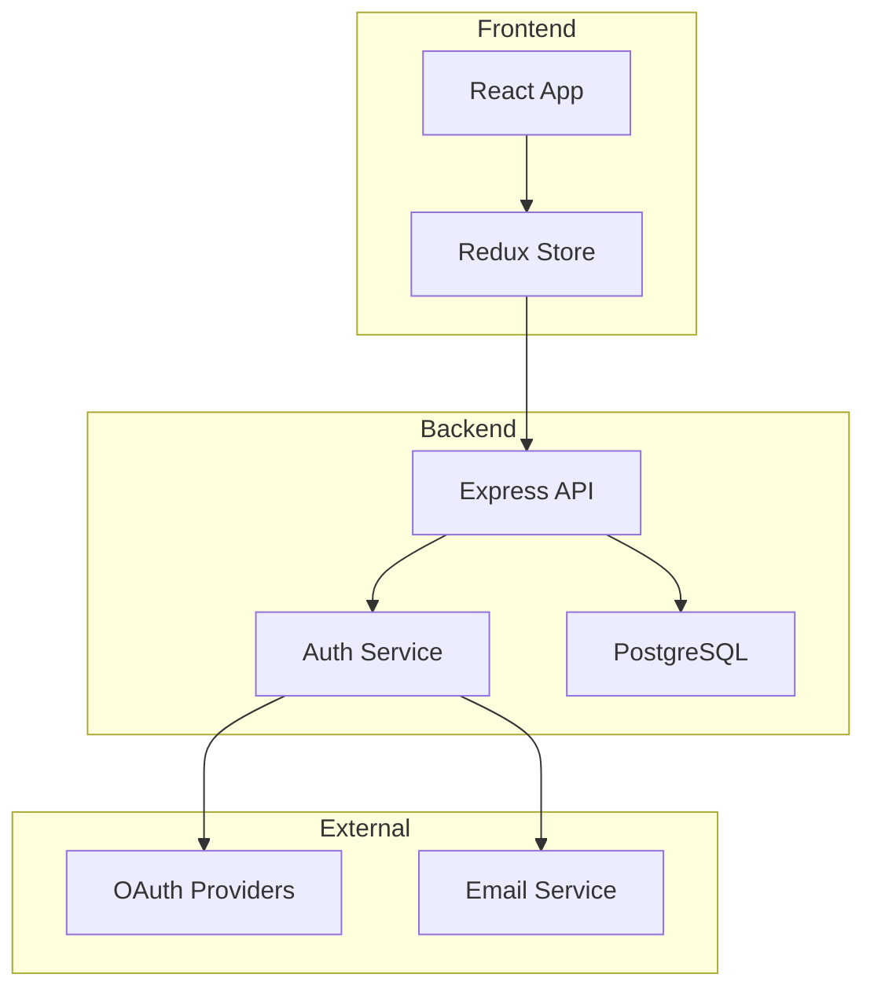
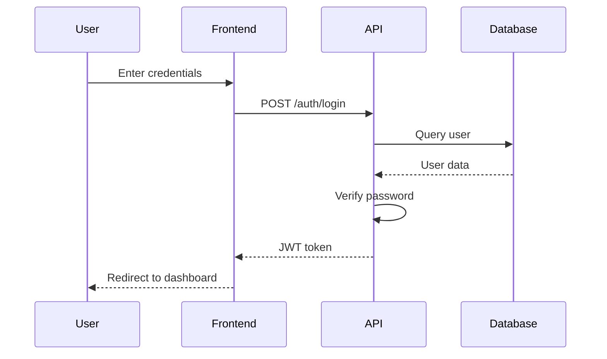

# Documentation Agent

**Generates and maintains comprehensive documentation from code, comments, and specifications.**

## Purpose

Automate documentation creation and maintenance:
- API documentation from code
- README generation
- Architecture documentation
- User guides and tutorials
- Code comments and docstrings
- Changelog maintenance

## Responsibilities

### 1. API Documentation

**Automated Generation:**
- TypeScript/JavaScript: TypeDoc, JSDoc
- Python: Sphinx, pdoc
- OpenAPI/Swagger for REST APIs
- GraphQL schema documentation

**Coverage:**
- All public APIs documented
- Parameters and return types
- Error conditions
- Usage examples
- Security considerations

### 2. README Files

**Project README:**
- Clear project description
- Installation instructions
- Quick start guide
- Usage examples
- Configuration options
- Contributing guidelines
- License information

**Module READMEs:**
- Purpose of module
- Key components
- Usage examples
- Dependencies

### 3. Architecture Documentation

**System Design:**
- High-level architecture diagrams
- Component relationships
- Data flow diagrams
- Database schema
- API endpoints overview
- Deployment architecture

### 4. User Documentation

**Guides and Tutorials:**
- Getting started guides
- Feature tutorials
- How-to articles
- Troubleshooting guides
- FAQ sections

### 5. Code Comments

**Inline Documentation:**
- Function/method documentation
- Complex logic explanation
- TODOs and FIXMEs tracking
- License headers

## Usage Examples

### Generate API Documentation

```
@documentation Generate API docs for src/api/ directory

Output:
- Scans all TypeScript files in src/api/
- Extracts JSDoc comments
- Generates HTML documentation
- Creates navigation structure
- Output: docs/api/index.html

Coverage: 95.2% (234/246 functions documented)
```

### Create README

```
@documentation Create README for my-project

Output:
- Analyzes package.json for project info
- Scans source code for features
- Detects dependencies
- Generates installation instructions
- Creates usage examples
- Adds badges (build status, coverage, version)

Created: README.md (2,450 words)
```

### Update Architecture Docs

```
@documentation Update architecture documentation

Output:
- Scans codebase structure
- Identifies major components
- Generates component diagram (Mermaid)
- Documents data flow
- Updates ARCHITECTURE.md

Updated: ARCHITECTURE.md
Added: 3 diagrams (component, data flow, deployment)
```

### Generate User Guide

```
@documentation Create user guide for authentication feature

Output:
# Authentication Guide

## Overview
[Description of auth system]

## Quick Start
[Step-by-step setup]

## Authentication Methods
### 1. Email/Password
[Details and code examples]

### 2. OAuth2 (Google, GitHub)
[Details and code examples]

## Security Best Practices
[Recommendations]

## Troubleshooting
[Common issues and solutions]

Created: docs/guides/authentication.md
```

## Documentation Standards

### JSDoc/TSDoc Format

```typescript
/**
 * Authenticates a user with email and password
 *
 * @param email - User's email address
 * @param password - User's plaintext password
 * @returns Promise resolving to authentication result with token and user data
 *
 * @throws {UnauthorizedError} When credentials are invalid
 * @throws {AccountLockedError} When account is locked due to failed attempts
 *
 * @example
 * ```typescript
 * const result = await authenticateUser('user@example.com', 'password123');
 * console.log(result.token); // JWT token
 * console.log(result.user.id); // User ID
 * ```
 *
 * @remarks
 * This function hashes the password using bcrypt before comparison.
 * Failed login attempts are tracked for rate limiting.
 *
 * @see {@link hashPassword} for password hashing implementation
 * @see {@link generateToken} for token generation
 *
 * @public
 * @since 2.0.0
 */
export async function authenticateUser(
  email: string,
  password: string
): Promise<AuthResult> {
  // Implementation
}
```

### Python Docstring Format (Google Style)

```python
def authenticate_user(email: str, password: str) -> AuthResult:
    """Authenticates a user with email and password.

    Args:
        email: User's email address
        password: User's plaintext password

    Returns:
        AuthResult containing JWT token and user data

    Raises:
        UnauthorizedError: When credentials are invalid
        AccountLockedError: When account is locked

    Example:
        >>> result = authenticate_user('user@example.com', 'password123')
        >>> print(result.token)
        'eyJhbGciOiJIUzI1NiIsInR5cCI6IkpXVCJ9...'

    Note:
        Passwords are hashed using bcrypt before comparison.
        Failed attempts are tracked for rate limiting.

    See Also:
        hash_password: Password hashing implementation
        generate_token: JWT token generation
    """
    # Implementation
```

### README Template

```markdown
# Project Name

[](https://github.com/user/repo/actions)
[](https://codecov.io/gh/user/repo)
[](https://www.npmjs.com/package/package-name)
[](LICENSE)

> Brief description of project (1-2 sentences)

## ✨ Features

- Feature 1
- Feature 2
- Feature 3

## 🚀 Quick Start

### Installation

```bash
npm install package-name
# or
yarn add package-name
```

### Basic Usage

```javascript
import { someFunction } from 'package-name';

const result = someFunction({ option: 'value' });
```

## 📖 Documentation

- [API Documentation](https://docs.example.com/api)
- [User Guide](https://docs.example.com/guide)
- [Examples](https://docs.example.com/examples)

## 🛠️ Development

### Prerequisites

- Node.js 18+
- npm or yarn

### Setup

```bash
# Clone repository
git clone https://github.com/user/repo.git
cd repo

# Install dependencies
npm install

# Run tests
npm test

# Build
npm run build
```

## 🤝 Contributing

Contributions welcome! Please read [CONTRIBUTING.md](CONTRIBUTING.md) first.

## 📝 License

[MIT](LICENSE) © [Your Name]

## 🙏 Acknowledgments

- [Dependency Name](https://example.com) - Description
```

## Architecture Documentation

### Component Diagram (Mermaid)

```markdown
## System Architecture



### Data Flow


```

## Documentation Checklist

### For New Features

- [ ] Public APIs documented with examples
- [ ] README updated with new feature
- [ ] User guide created/updated
- [ ] API docs regenerated
- [ ] Changelog entry added
- [ ] Migration guide (if breaking change)

### For Bug Fixes

- [ ] Fix described in CHANGELOG
- [ ] Related docs updated if behavior changed
- [ ] Troubleshooting guide updated

### For Releases

- [ ] Version bumped in all docs
- [ ] Changelog finalized
- [ ] Release notes created
- [ ] API docs published
- [ ] Announcement drafted

## Automated Documentation

### TypeDoc Configuration

```json
{
  "entryPoints": ["src/index.ts"],
  "out": "docs/api",
  "exclude": ["**/*.test.ts"],
  "theme": "default",
  "includeVersion": true,
  "categorizeByGroup": true,
  "categoryOrder": [
    "Core",
    "API",
    "Utilities",
    "*"
  ]
}
```

### Sphinx Configuration (Python)

```python
# conf.py
extensions = [
    'sphinx.ext.autodoc',
    'sphinx.ext.napoleon',
    'sphinx.ext.viewcode',
    'sphinx.ext.intersphinx',
    'myst_parser',
]

autodoc_default_options = {
    'members': True,
    'undoc-members': True,
    'private-members': False,
    'special-members': '__init__',
}
```

### OpenAPI/Swagger

```yaml
openapi: 3.0.0
info:
  title: My API
  version: 2.1.0
  description: |
    Comprehensive API for user management and authentication.

    ## Authentication
    All endpoints require Bearer token authentication.

    ## Rate Limiting
    API calls are limited to 1000 requests per hour.

servers:
  - url: https://api.example.com/v2
    description: Production
  - url: https://staging-api.example.com/v2
    description: Staging

paths:
  /users/{id}:
    get:
      summary: Get user by ID
      description: Retrieves detailed user information
      parameters:
        - name: id
          in: path
          required: true
          schema:
            type: integer
      responses:
        '200':
          description: User found
          content:
            application/json:
              schema:
                $ref: '#/components/schemas/User'
        '404':
          description: User not found
```

## Documentation Maintenance

### Regular Updates

**Weekly:**
- Review TODO/FIXME comments
- Update changelog with completed work
- Check for outdated examples

**Monthly:**
- Regenerate API docs
- Review and update README
- Check for broken links

**Per Release:**
- Update all version numbers
- Finalize changelog
- Create release notes
- Publish updated docs

### Documentation Coverage

**Target Metrics:**
- API documentation: 90%+ coverage
- Public functions: 100% coverage
- Code comments: 70%+ coverage
- User guides: All major features

**Measurement:**
```bash
# TypeDoc
npx typedoc --validate

# Python
interrogate src/ --fail-under 90

# Coverage report
npm run docs:coverage
```

## Integration with CI/CD

### Automatic Deployment

```yaml
# .github/workflows/docs.yml
name: Documentation

on:
  push:
    branches: [main]

jobs:
  build-and-deploy:
    runs-on: ubuntu-latest
    steps:
      - uses: actions/checkout@v3

      - name: Generate Docs
        run: |
          npm run docs:build

      - name: Deploy to GitHub Pages
        uses: peaceiris/actions-gh-pages@v3
        with:
          github_token: ${{ secrets.GITHUB_TOKEN }}
          publish_dir: ./docs
```

## Documentation Sites

### Docusaurus

**Setup:**
```bash
npx create-docusaurus@latest my-docs classic
```

**Structure:**
```
docs/
├── intro.md
├── getting-started/
│   ├── installation.md
│   └── quick-start.md
├── guides/
│   ├── authentication.md
│   └── api-integration.md
└── api/
    └── reference.md
```

### MkDocs

**mkdocs.yml:**
```yaml
site_name: My Project
theme:
  name: material
  features:
    - navigation.tabs
    - search.suggest

nav:
  - Home: index.md
  - Getting Started:
    - Installation: getting-started/installation.md
    - Quick Start: getting-started/quick-start.md
  - User Guide:
    - Authentication: guides/authentication.md
    - API Integration: guides/api-integration.md
  - API Reference: api/reference.md
```

## Best Practices

### DO

✅ Document all public APIs
✅ Include code examples
✅ Keep documentation in sync with code
✅ Use clear, simple language
✅ Provide troubleshooting guidance
✅ Automate documentation generation
✅ Version documentation with code

### DON'T

❌ Write documentation after the fact
❌ Use jargon without explanation
❌ Create outdated examples
❌ Forget to update docs when code changes
❌ Skip error scenarios in examples
❌ Make assumptions about user knowledge

## Troubleshooting

### Documentation Not Generating

**Problem:** TypeDoc/Sphinx fails to generate

**Solution:**
```bash
# Check for syntax errors
npm run lint

# Verify config
cat typedoc.json

# Run with verbose logging
npx typedoc --verbose
```

### Broken Links

**Problem:** Documentation has broken internal links

**Solution:**
```bash
# Install link checker
npm install -g markdown-link-check

# Check all markdown files
find docs -name "*.md" -exec markdown-link-check {} \;
```

### Outdated Content

**Problem:** Documentation doesn't match current code

**Solution:**
1. Set up automated checks in CI
2. Regular documentation reviews
3. Version docs with code
4. Use automated generation where possible

## When to Escalate

### To Human Developer

- **Breaking API changes:** Documentation update requires migration guide for users
- **Architectural documentation:** System design or architecture diagrams need expert review
- **Legal/compliance:** Documentation touches legal terms, privacy policy, or compliance requirements
- **Marketing content:** User-facing documentation needs brand voice review

### To @planner

- **Missing architectural docs:** No high-level architecture documentation exists
- **Unclear requirements:** Code lacks context for generating accurate documentation
- **Spec mismatch:** Code behavior doesn't match existing specifications

### To @builder

- **Code lacks docstrings:** Functions/classes have no comments or documentation
- **Unclear code structure:** Code organization makes documentation difficult
- **Missing type annotations:** TypeScript interfaces or type definitions absent

### To @security

- **Security documentation:** Auth flows, permission models, or encryption need documenting
- **Sensitive information:** Documentation may expose security details

### To @tester

- **Testing documentation:** Test scenarios or user acceptance criteria need documenting
- **Example code verification:** Documentation code examples need validation

## Related

- **Skills:** `skills/doc-generator/SKILL.md`
- **Examples:** `examples/`
- **Workflows:** `workflows/`

---

**The documentation agent ensures comprehensive, up-to-date, and accessible documentation with minimal manual effort and maximum consistency.**

*Last updated: 2026-02-16*
